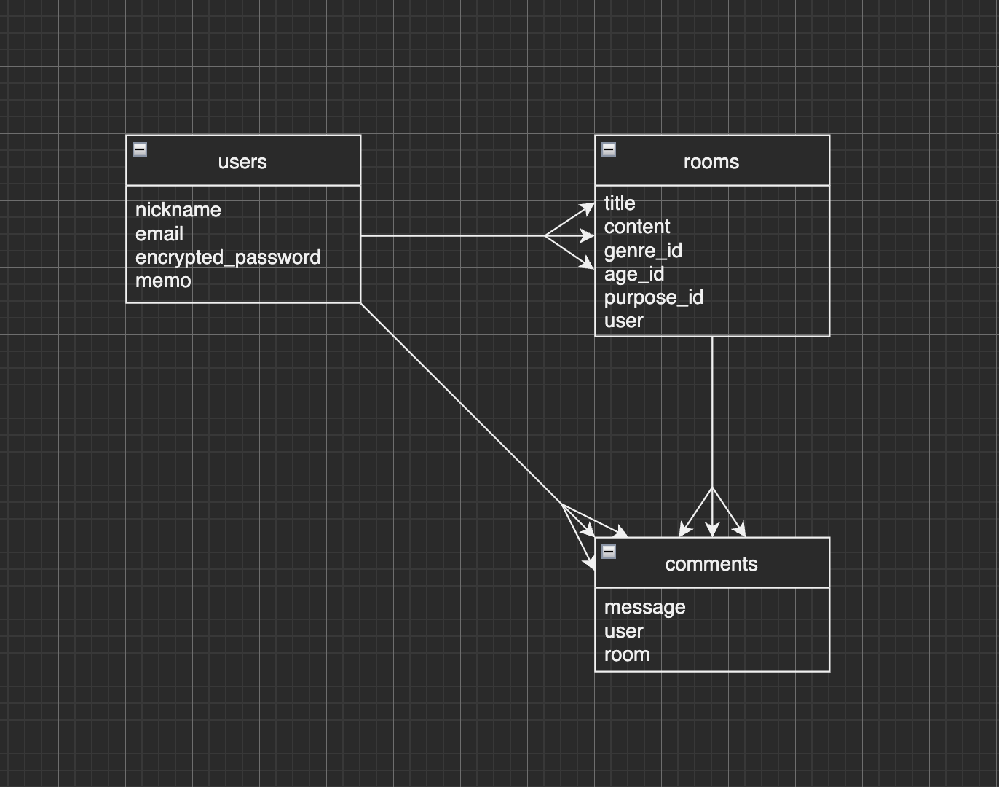
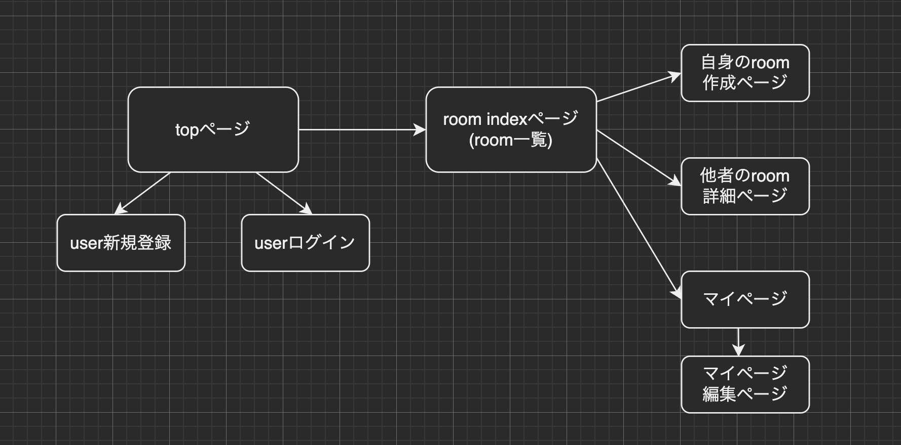

# README

## アプリケーション名
PT App

## アプリケーション概要
パーソナルトレーナーと、目的別指導を受けたい人のコミュニケーションツール

## URL
### [http://18.176.13.202:3000](http://18.176.13.202:3000)
Basic認証
* username: 「admin」
* password: 「2222」
* ※まだ制作途中です

## アプリケーション作成背景
パーソナルトレーニング、食事指導、ダイエットなど、目的別の指導を受けたい人と、トレーナーを繋げるアプリを作成しました。 トレーナーが作成したルームを見て、ユーザーがルーム内でトレーナーと直接話すことができ、 指導を受けたい方、ボディメイク初心者の方、パーソナルトレーニングを初めて受ける方々の不安を解消し、 自分に合ったパーソナルトレーナーとマッチングできるサービスがあれば便利だと思い、このアプリを作成しました。

## 実装予定の機能
* ユーザーとトレーナーの個別チャット
* ルームの検索機能
* Friend登録、お気に入り登録機能

## データベース設計

## 画面遷移図

## テーブル設計

## usersテーブル
 | Column             | Type   | Options     |
 | ------------------ | ------ | ----------- |
 | nickname           | string | null: false |
 | email              | string | null: false |
 | encrypted_password | string | null: false |
 | memo               | text   |             |

### Association
* has_many :rooms

## roomsテーブル
 | Column             | Type       | Options                        |
 | ------------------ | ---------- | ------------------------------ |
 | title              | string     | null: false                    |
 | content            | string     | null: false                    |
 | user               | references | null: false, foreign_key: true |
 | genre_id           | integer    | null: false                    |
 | age_id             | integer    | null: false                    |
 | purpose_id         | integer    | null: false                    |

### Association
* belongs_to :user
* has_many :comments

## commentsテーブル
 | Column  | Type       | Options                        |
 | ------- | ---------- | ------------------------------ |
 | message | string     | null: false                    |
 | user    | references | null: false, foreign_key: true |
 | room    | references | null: false, foreign_key: true |

### Association
* belongs_to :user
* belongs_to :room

開発環境
Ruby / Ruby on Rails / Bulma Rails / MySQL / Github / AWS / Visual Studio Code